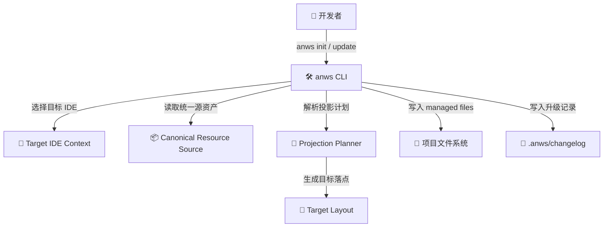
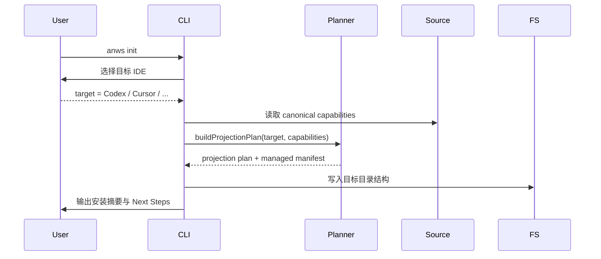
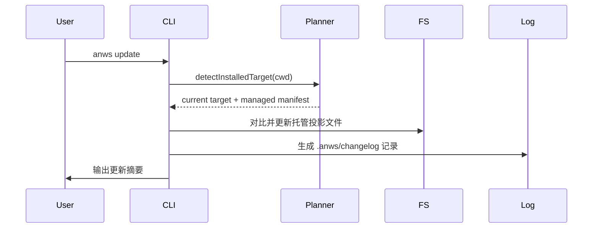

# 系统架构总览 (Architecture Overview)

**项目**: `anws` — 多 AI IDE 单目标分发 CLI
**版本**: 5.0
**日期**: 2026-03-14
**关联 ADR**: `03_ADR/ADR_004_MULTI_TOOL_ADAPTERS.md`, `03_ADR/ADR_006_CANONICAL_RESOURCE_MODEL.md`

---

## 1. 系统上下文 (System Context)



---

## 2. 系统清单 (System Inventory)

### System 1: CLI Orchestrator
**系统 ID**: `cli-orchestrator`

**职责**:
- 解析命令与交互输入
- 在 `init` 中选择目标 IDE
- 在 `update` 中解析已安装目标上下文
- 协调投影计划、文件写入、差异比较与终端输出

**源码根目录**: `src/anws/bin/` + `src/anws/lib/`

---

### System 2: Canonical Resource Source
**系统 ID**: `canonical-resource-source`

**职责**:
- 存放 `anws` 的权威能力资产
- 提供 workflow、skill、prompt 等投影前内容来源
- 避免不同目标 IDE 长期维护分叉副本

**推荐逻辑位置**: `src/anws/templates/`（可逐步从现有 `.agents` 模板演进）

---

### System 3: Projection Planner
**系统 ID**: `projection-planner`

**职责**:
- 将 capability 解析为目标相关的资源投影
- 根据目标 IDE 计算文件路径、文件命名、资源形态与 managed projection manifest
- 是工具差异存在的唯一合法边界

**推荐逻辑位置**: `src/anws/lib/adapters/` + `src/anws/lib/manifest.js`

---

### System 4: Target Layout Writer
**系统 ID**: `target-layout-writer`

**职责**:
- 根据 projection plan 创建目录并写入目标文件
- 处理初始化与更新时的 managed files 覆盖边界
- 维持用户自定义内容保护规则

**推荐逻辑位置**: `src/anws/lib/init.js`, `src/anws/lib/update.js`, `src/anws/lib/copy.js`

---

## 3. 关键边界

| 系统 | 输入 | 输出 | 风险边界 |
|------|------|------|---------|
| CLI Orchestrator | argv, stdin, cwd | target selection, flow control | 不能把目标选择和写文件逻辑揉死在一个大函数里 |
| Canonical Resource Source | 模板资产 | 可投影资源 | 不得等同于某一目标目录结构 |
| Projection Planner | target IDE + canonical resources | projection plan + managed manifest | 不得散落成 if/else 丛林 |
| Target Layout Writer | projection plan | 文件写入结果 | 不得越权覆盖非托管文件 |

---

## 4. 目标投影矩阵

| Target IDE | Capability Projection | Physical Layout |
|------------|-----------------------|-----------------|
| Windsurf | workflow + skill | `.windsurf/workflows/`, `.windsurf/skills/` |
| Antigravity | workflow + skill | `.agents/workflows/`, `.agents/skills/` |
| Cursor | command | `.cursor/commands/` |
| Claude | command | `.claude/commands/` |
| GitHub Copilot | agent + prompt | `.github/agents/`, `.github/prompts/` |
| Codex | prompt + skill | `.codex/prompts/`, `.codex/skills/` |

---

## 5. 关键执行流程

### Flow A: `anws init`



### Flow B: `anws update`



---

## 6. 物理代码结构建议

```text
src/
└── anws/
    ├── bin/
    │   └── cli.js
    ├── lib/
    │   ├── init.js
    │   ├── update.js
    │   ├── manifest.js
    │   ├── copy.js
    │   ├── adapters/
    │   │   ├── index.js
    │   │   ├── windsurf.js
    │   │   ├── antigravity.js
    │   │   ├── cursor.js
    │   │   ├── claude.js
    │   │   ├── copilot.js
    │   │   └── codex.js
    │   └── resources/
    │       └── index.js
    └── templates/
        ├── canonical/
        │   ├── workflows/
        │   ├── skills/
        │   ├── prompts/
        │   └── AGENTS.md
        └── projections/
            └── snapshots/   # 可选，仅用于测试或发布校验
```

> [!WARNING]
> AI 推断填充，请人类复核。
>
> `canonical/` 与 `projections/` 是推荐结构，用于明确“统一源”和“目标投影”的边界。若实现阶段为了渐进迁移继续沿用现有模板目录，也必须保证逻辑真相仍然是 capability → projection → layout，而不是 `.agents` → 其他目录的硬编码复制。

---

## 7. 架构原则

### 7.1 单目标安装优先

用户一次初始化只服务一个目标 IDE。这样才能让安装行为、帮助文案、managed files 和升级路径保持清晰。

### 7.2 目录不是权威，投影才是权威

`.agents`、`.windsurf`、`.cursor`、`.claude`、`.github`、`.codex` 都只是投放结果，不是内部设计真相。

### 7.3 更新遵循已安装目标上下文

`update` 的职责是升级当前已安装目标的托管投影，而不是顺便切换目标或生成额外目录。

### 7.4 工具差异必须集中收口

所有目标差异必须被封装在 Projection Planner / Adapter Layer 中，而不能扩散到 CLI 文案、文件复制、README 等所有层面。
