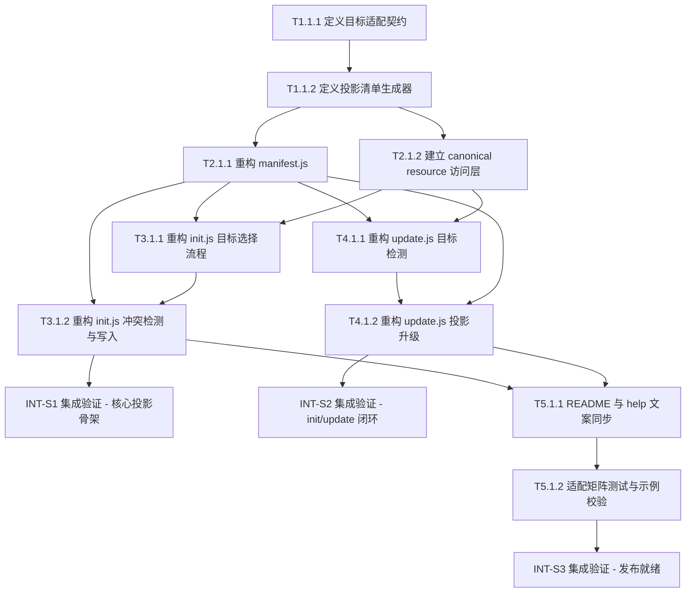

# .anws v5 - 任务清单 (05_TASKS)

## 依赖图

---

## 📊 Sprint 路线图

| Sprint | 代号 | 核心任务 | 退出标准 | 预估 |
|--------|------|---------|---------|------|
| S1 | Projection Core | adapter contract + projection manifest + canonical access | 能对任一目标生成可解释的 managed projection 清单 | 2-3d |
| S2 | Install/Update Refactor | init/update 改为目标感知流程 | `init` / `update` 不再写死 `.agents`，并可围绕单目标工作 | 3-4d |
| S3 | Docs/Test/Release Prep | README/help/test/git 切分 | 文案、测试、示例与提交边界一致 | 2-3d |

### Sprint 退出标准

- **S1**: 已能通过代码接口为指定 target 生成 `managed projection manifest`，且不再把 `.agents` 常量数组当成唯一真相。
- **S2**: `init` 可以先选目标 IDE 并仅安装该目标；`update` 可以识别当前目标并只升级该目标托管文件。
- **S3**: README / help / 测试全部与单目标安装模型一致，形成可提交的语义切分。

---

## Sprint S1 — Projection Core

- [ ] **T1.1.1** [REQ-002] [REQ-003]: 定义目标适配契约与最小 adapter matrix
  - **描述**: 为 Windsurf、Antigravity、Cursor、Claude、GitHub Copilot、Codex 定义统一 adapter contract，至少包含 `target id`、`resource projection types`、`output roots`、`root file policy`、`installed target detection hints`。
  - **输入**: `.anws/v5/01_PRD.md` 中的 Target Matrix；`.anws/v5/02_ARCHITECTURE_OVERVIEW.md` 中的 Projection Planner 边界；`.anws/v5/03_ADR/ADR_004_MULTI_TOOL_ADAPTERS.md`。
  - **输出**: adapter contract 设计结果；目标矩阵映射表；后续代码文件接口草案（建议落点 `src/anws/lib/adapters/`）。
  - **验收标准**:
    - Given 第一批目标 IDE 已确定
    - When 评审 adapter contract
    - Then 每个目标都能回答“投影成什么资源、落到什么目录、如何识别已安装目标”
  - **验证类型**: 手动验证
  - **验证说明**: 阅读契约定义，逐项核对 6 个目标是否都具备完整字段，且没有把平台差异泄漏到 `init.js` / `update.js`
  - **估时**: 4h
  - **依赖**: 无

- [ ] **T1.1.2** [REQ-002] [REQ-004]: 定义 managed projection manifest 生成器
  - **描述**: 设计 `manifest.js` 的新职责，使其从“固定常量数组”演进为“根据 target + canonical resources 生成托管文件清单”的接口，明确输入输出结构、排序规则、root file 特例和用户保护文件策略。
  - **输入**: T1.1.1 产出的 adapter contract；现有 `src/anws/lib/manifest.js`。
  - **输出**: manifest 生成接口设计；managed projection manifest 数据结构；用户保护规则迁移方案。
  - **验收标准**:
    - Given 已有 adapter contract
    - When 定义 manifest 生成器接口
    - Then 接口能表达不同目标下不同文件清单，而不是依赖单一 `.agents` 数组
  - **验证类型**: 手动验证
  - **验证说明**: 检查 manifest 结构是否能覆盖 AGENTS、workflow、skill、command、prompt、agent 等不同资源形态及其路径生成逻辑
  - **估时**: 4h
  - **依赖**: T1.1.1

- [ ] **T2.1.1** [REQ-004]: 重构 `manifest.js` 为目标感知清单模块
  - **描述**: 将 `src/anws/lib/manifest.js` 改造为目标感知模块，导出按 target 计算 managed files 与 user protected files 的能力，并保留向后兼容所需的最小过渡层。
  - **输入**: T1.1.2 产出的 manifest 接口设计；现有 `src/anws/lib/manifest.js`。
  - **输出**: 新版 `src/anws/lib/manifest.js`；必要的辅助函数或数据模块。
  - **验收标准**:
    - Given 指定 target 为任一首批 IDE
    - When 调用 manifest 模块
    - Then 可获得该目标的托管文件清单与保护策略
  - **验证类型**: 单元测试
  - **验证说明**: 运行 manifest 层测试，确认不同 target 返回不同清单且包含预期路径
  - **估时**: 6h
  - **依赖**: T1.1.2

- [ ] **T2.1.2** [REQ-002]: 建立 canonical resource 访问层
  - **描述**: 从当前模板结构中抽出“统一源访问入口”，至少让后续 `init` / `update` 不直接耦合 `templates/.agents` 目录。首期允许保留现有模板目录，但必须新增一个资源访问层统一输出 capability / projection 所需输入。
  - **输入**: `.anws/v5/02_ARCHITECTURE_OVERVIEW.md` 中 Canonical Resource Source 边界；现有 `src/anws/templates/` 结构；T1.1.1 adapter contract。
  - **输出**: canonical resource access 模块（建议落点 `src/anws/lib/resources/`）；资源索引策略；渐进迁移说明。
  - **验收标准**:
    - Given 后续流程需要读取 canonical resources
    - When 调用资源访问层
    - Then 不需要在业务流程中直接写死 `templates/.agents` 路径
  - **验证类型**: 单元测试
  - **验证说明**: 验证资源访问层可返回后续投影规划所需的源资源集合，并可被多个 target 复用
  - **估时**: 6h
  - **依赖**: T1.1.2

- [ ] **INT-S1** [MILESTONE]: S1 集成验证 — Projection Core
  - **描述**: 验证 projection core 已经可以围绕不同目标生成合理的 managed projection manifest，并为 `init` / `update` 提供稳定输入。
  - **输入**: T1.1.1 的 adapter contract；T1.1.2 的 manifest 设计；T2.1.1 的 manifest 模块；T2.1.2 的 resource access 模块。
  - **输出**: S1 集成验证结果（通过 / 失败 + 缺口清单）。
  - **验收标准**:
    - Given S1 所有任务已完成
    - When 针对至少 3 个目标生成 projection manifest 并进行人工比对
    - Then 结果结构一致、目录映射正确、未回落为 `.agents` 单目标常量模型
  - **验证类型**: 集成测试
  - **验证说明**: 执行 manifest / resource access 的集成校验，确认不同目标的清单可生成且结构稳定
  - **估时**: 3h
  - **依赖**: T2.1.1, T2.1.2

---

## Sprint S2 — Install / Update Refactor

- [ ] **T3.1.1** [REQ-001] [REQ-003]: 重构 `init.js` 的目标选择流程
  - **描述**: 为 `anws init` 增加目标 IDE 选择能力，支持交互选择与非交互默认策略，输出目标上下文给后续 projection plan；同时保留对 legacy `.agent` 迁移问题的清晰边界。
  - **输入**: T1.1.1 的 adapter contract；T2.1.1 的 manifest 模块；现有 `src/anws/lib/init.js`。
  - **输出**: 目标选择流程；目标上下文对象；必要的交互函数与 CLI 接口调整点。
  - **验收标准**:
    - Given 用户执行 `anws init`
    - When 进入初始化流程
    - Then CLI 会先确定单一目标 IDE，而不是默认写 `.agents`
  - **验证类型**: 集成测试
  - **验证说明**: 在交互和非交互场景分别验证目标选择行为、默认行为和异常提示是否清楚
  - **估时**: 5h
  - **依赖**: T2.1.1, T2.1.2

- [ ] **T3.1.2** [REQ-001] [REQ-004]: 重构 `init.js` 的冲突检测与写入流程
  - **描述**: 让 `findConflicts`、`overwriteManaged`、初次写入与结果输出全部改为消费 projection manifest，不再写死 `.agents` 源路径与目标路径；同时根据目标类型调整成功文案与 Next Steps。
  - **输入**: T3.1.1 产出的目标上下文；T2.1.1 的 managed projection manifest；现有 `src/anws/lib/init.js`。
  - **输出**: 新版 `init.js`；目标感知冲突检测逻辑；目标感知安装结果输出。
  - **验收标准**:
    - Given 用户已选择目标 IDE
    - When 初始化存在冲突或首次安装
    - Then CLI 只检测和写入该目标相关的托管文件，并输出对应目录结果
  - **验证类型**: 集成测试
  - **验证说明**: 在空目录和存在冲突的目录分别验证安装结果，确认不会错误触碰其他目标目录
  - **估时**: 6h
  - **依赖**: T3.1.1

- [ ] **T4.1.1** [REQ-004]: 重构 `update.js` 的已安装目标检测
  - **描述**: 为 `anws update` 增加 installed target detection，能根据目标目录标记、清单或辅助元数据推断当前项目已安装的 target，并在缺失或冲突时给出明确提示。
  - **输入**: T1.1.1 的 detection hints；T2.1.1 的 manifest 模块；现有 `src/anws/lib/update.js`。
  - **输出**: installed target detection 逻辑；目标冲突 / 缺失提示；必要的辅助元数据方案。
  - **验收标准**:
    - Given 当前项目已安装某个 target
    - When 执行 `anws update`
    - Then CLI 能识别该 target，而不是只检查 `.agents`
  - **验证类型**: 集成测试
  - **验证说明**: 使用至少 3 个目标目录样例验证目标识别结果，确认误判场景有提示
  - **估时**: 5h
  - **依赖**: T2.1.1, T2.1.2

- [ ] **T4.1.2** [REQ-004]: 重构 `update.js` 的投影升级闭环
  - **描述**: 让 `collectManagedFileDiffs`、更新循环、提示文案、升级记录生成全部改为围绕当前 target 的 managed projection 执行；同时保留 `AGENTS.md` 的特殊合并策略，但不再假设所有目标都必须走 `.agents` 根目录。
  - **输入**: T4.1.1 的 installed target detection；T2.1.1 的 manifest 模块；现有 `src/anws/lib/update.js`。
  - **输出**: 新版 `update.js`；目标感知 diff 逻辑；目标感知升级输出。
  - **验收标准**:
    - Given 当前项目已安装某个 target
    - When 执行 `anws update` 或 `anws update --check`
    - Then 仅预览或更新该 target 的托管投影文件，并保留用户自定义内容
  - **验证类型**: 集成测试
  - **验证说明**: 分别验证预览模式和写入模式，确认更新范围仅限当前目标，且 changelog 正常生成
  - **估时**: 6h
  - **依赖**: T4.1.1

- [ ] **INT-S2** [MILESTONE]: S2 集成验证 — init / update 闭环
  - **描述**: 验证单目标安装与目标感知升级流程已经形成闭环，包括初始化、冲突处理、更新预览、正式升级与升级记录生成。
  - **输入**: T3.1.1, T3.1.2, T4.1.1, T4.1.2 的产出。
  - **输出**: S2 集成验证结果（通过 / 失败 + Bug 清单）。
  - **验收标准**:
    - Given S2 所有任务已完成
    - When 针对至少 2 个不同 target 完整执行 init → update --check → update
    - Then 每条流程都只处理当前目标文件，并输出正确升级记录
  - **验证类型**: 集成测试
  - **验证说明**: 使用示例目录或临时目录进行闭环验证，记录每次写入结果、预览 diff 和 changelog 输出
  - **估时**: 4h
  - **依赖**: T3.1.2, T4.1.2

---

## Sprint S3 — Docs / Test / Release Prep

- [ ] **T5.1.1** [REQ-005]: 同步 README 与 CLI help 到单目标安装模型
  - **描述**: 更新 `src/anws/bin/cli.js` 的 help 文案与 `README.md`、`README_CN.md`、`src/anws/README.md`、`src/anws/README_CN.md`，明确 `init` 会先选择目标 IDE，且不再把 `.agents` 描述为唯一安装目标。
  - **输入**: `.anws/v5/01_PRD.md`；T3.1.2 与 T4.1.2 的最终行为；现有 README / help 文本。
  - **输出**: 更新后的 help 文案；四份 README 的对齐修改。
  - **验收标准**:
    - Given 用户阅读 help 或 README
    - When 查找安装和更新说明
    - Then 能清楚理解单目标 IDE 安装和目标感知更新模型
  - **验证类型**: 手动验证
  - **验证说明**: 逐份阅读文档，核对示例命令、目录描述和行为说明是否与实际实现一致
  - **估时**: 4h
  - **依赖**: T3.1.2, T4.1.2

- [ ] **T5.1.2** [REQ-003] [REQ-004] [REQ-005]: 建立适配矩阵测试与示例校验
  - **描述**: 以 `ide_example/`、`.windsurf/` 和必要的临时样例为基线，建立最小测试 / 校验清单，覆盖目标矩阵、清单生成、安装落点与更新预览结果。
  - **输入**: T2.1.1 的 manifest 模块；T3.1.2 与 T4.1.2 的实现；`ide_example/`；`.windsurf/`。
  - **输出**: 适配矩阵测试方案；校验脚本或手动验证清单；样例验证结果。
  - **验收标准**:
    - Given 第一批目标工具已纳入
    - When 运行测试或执行校验清单
    - Then 至少能证明目录映射、安装落点、更新边界与示例认知一致
  - **验证类型**: 集成测试
  - **验证说明**: 对照 `ide_example/` 和 `.windsurf/` 执行目标矩阵校验，确认路径与资源形态符合设计
  - **估时**: 5h
  - **依赖**: T5.1.1

- [ ] **T5.1.3** [REQ-004] [REQ-005]: 规划分轮 git 提交边界
  - **描述**: 将本轮实施切分为若干语义清晰的提交批次，例如“projection core”、“init/update refactor”、“docs/help sync”、“matrix tests”，并明确每批不应混入的文件类型，避免把临时目录、示例副本或旧协议产物带入提交。
  - **输入**: 全部任务产出；当前工作区结构；已有分轮提交策略。
  - **输出**: 提交批次建议；每批建议包含文件范围、提交主题和禁止混入项。
  - **验收标准**:
    - Given 任务已接近完成
    - When 准备提交代码
    - Then 能按清晰语义拆批，且不会误纳入 `.tmp/`、`ide_example/` 或旧协议产物
  - **验证类型**: 手动验证
  - **验证说明**: 检查每批提交候选文件列表，确认边界清晰且无临时或演示产物
  - **估时**: 2h
  - **依赖**: T5.1.2

- [ ] **INT-S3** [MILESTONE]: S3 集成验证 — 发布就绪
  - **描述**: 验证 v5 的任务闭环已经完整，包括实现、文档、帮助文案、测试结果和提交策略。
  - **输入**: T5.1.1, T5.1.2, T5.1.3 的产出；S1 / S2 的已完成结果。
  - **输出**: 发布就绪检查结果（通过 / 失败 + 待补项）。
  - **验收标准**:
    - Given S3 所有任务已完成
    - When 逐项检查文档、帮助、测试、提交边界
    - Then v5 可进入实现收尾和分轮提交阶段
  - **验证类型**: 手动验证
  - **验证说明**: 对照 PRD 与 Architecture Overview 做最终核对，确认所有高优先级需求均有任务与验证证据
  - **估时**: 3h
  - **依赖**: T5.1.3

---

## 🎯 User Story Overlay

### REQ-001: 单目标 IDE 初始化
**涉及任务**: T3.1.1 → T3.1.2 → INT-S2  
**关键路径**: T2.1.1 → T3.1.1 → T3.1.2  
**独立可测**: ✅ S2 结束即可演示  
**覆盖状态**: ✅ 完整

### REQ-002: 统一源资源投影
**涉及任务**: T1.1.1 → T1.1.2 → T2.1.1 → T2.1.2 → INT-S1  
**关键路径**: T1.1.1 → T1.1.2 → T2.1.1  
**独立可测**: ✅ S1 结束即可验证  
**覆盖状态**: ✅ 完整

### REQ-003: 目标适配矩阵
**涉及任务**: T1.1.1 → T3.1.1 → T5.1.2  
**关键路径**: T1.1.1 → T5.1.2  
**独立可测**: ✅ S3 前可阶段性验证  
**覆盖状态**: ✅ 完整

### REQ-004: 多目标安全更新
**涉及任务**: T1.1.2 → T2.1.1 → T4.1.1 → T4.1.2 → INT-S2 → T5.1.2  
**关键路径**: T2.1.1 → T4.1.1 → T4.1.2  
**独立可测**: ✅ S2 结束即可验证  
**覆盖状态**: ✅ 完整

### REQ-005: 文案与帮助一致性
**涉及任务**: T4.1.2 → T5.1.1 → T5.1.2 → INT-S3  
**关键路径**: T4.1.2 → T5.1.1  
**独立可测**: ✅ S3 结束即可验证  
**覆盖状态**: ✅ 完整
